# Индексы: оптимизация запросов / ДЗ
 Описание/Пошаговая инструкция выполнения домашнего задания:
1. Сгенерировать любым способом 1,000,000 анкет. Имена и Фамилии должны быть реальными (чтобы учитывать селективность индекса) (или воспользовать уже готовым списком)
2. Реализовать функционал поиска анкет по префиксу имени и фамилии (одновременно) в вашей социальной сети (реализовать метод /user/search из спецификации) (запрос в форме firstName LIKE ? and secondName LIKE ?). Сортировать вывод по id анкеты. Использовать InnoDB движок.
3. Провести нагрузочные тесты этого метода. Поиграть с количеством одновременных запросов. 1/10/100/1000.
4. Построить графики и сохранить их в отчет
5. Сделать подходящий индекс.
6. Повторить пункт 3 и 4.
7. В качестве результата предоставить отчет в котором должны быть:
- графики latency до индекса;
- графики throughput до индекса;
- графики latency после индекса;
- графики throughput после индекса;
- запрос добавления индекса;
- explain запросов после индекса;
- объяснение почему индекс именно такой;
ДЗ принимается в виде отчета по выполненной работе

---

## Реализация: 

1. Скачать people.cvs
2. Запустить `people-filler.py` 

3. Метод поиска работает 
```
curl -X 'POST' \
  'http://127.0.0.1:8000/users/search/by_fl_names?first_prefix=%D0%9D%D0%B0%D1%82%D0%B0%D0%BB%D1%8C%D1%8F&second_prefix=%D0%90%D0%BB%D0%B5%D0%BA&skip=0&limit=20' \
  -H 'accept: application/json' \
  -d ''
```

4. Графики
- Без индекса (Thouthgput, Latency)
Критический момент ~20 пользователей (за минуту), приложение частями начинает падать
- - 5 пользователей:
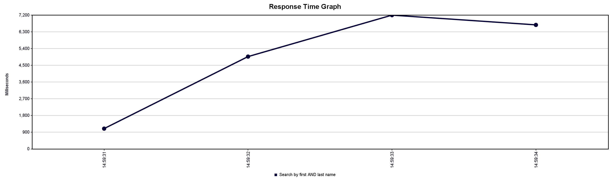
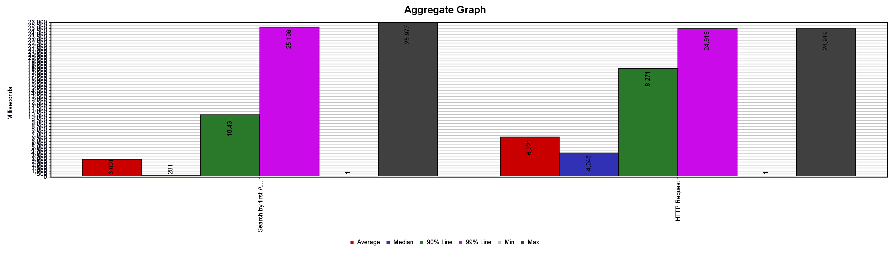

- - 50 пользователей
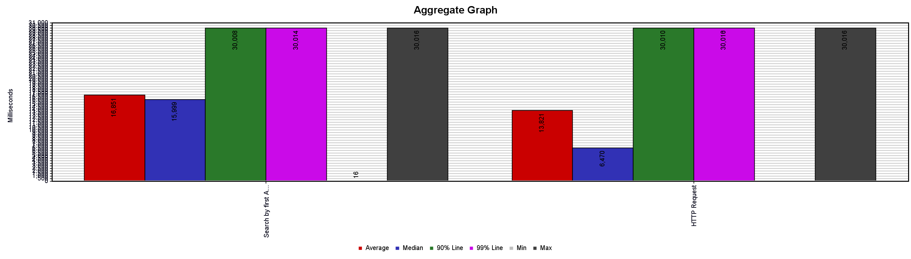
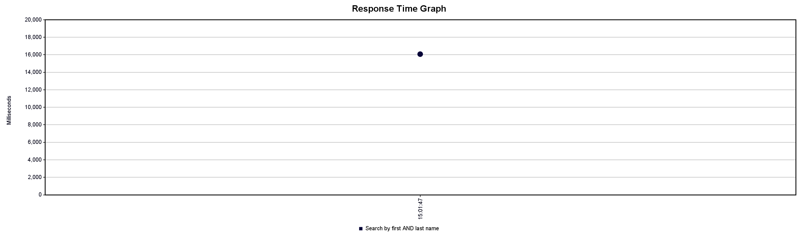


- С индексом
- - 5 пользователей
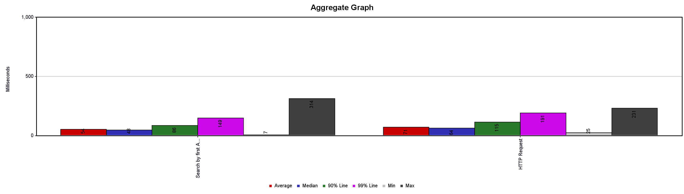
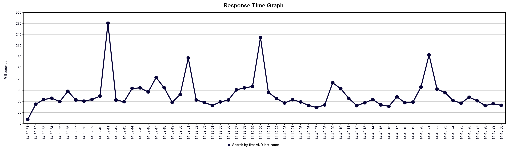
- - 100 пользователей
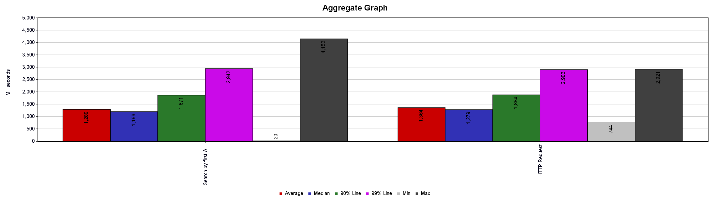
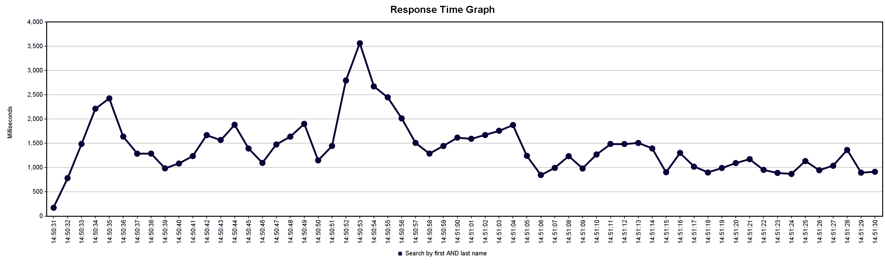
- - 150 пользователей
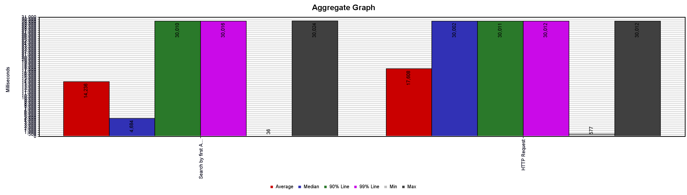
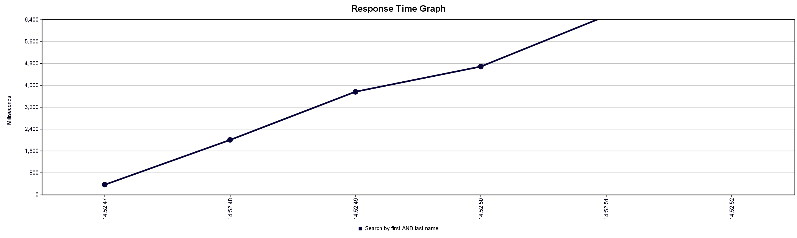

### Добавление индекса

#### Запрос добавления индекса
````commandline
CREATE INDEX "first-second-plus-id"
    ON public.users USING btree
    (second_name COLLATE pg_catalog."C" ASC NULLS LAST, first_name COLLATE pg_catalog."C" ASC NULLS LAST)
    INCLUDE(id)
    TABLESPACE pg_default;
````

#### Explain запросов после индекса
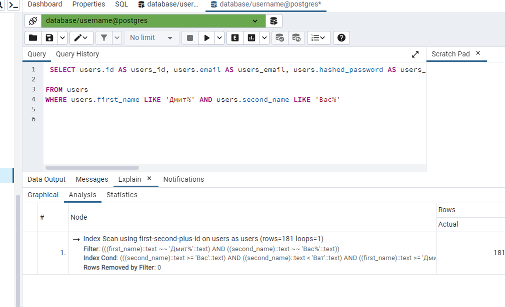

#### Объяснение почему индекс именно такой:
- В поиске используется условие LIKE _first_name_perfix_ **AND** LIKE _second_name_perfix_ 
поэтому планировщик будет искать совпадение обоих полей
- Тип Btree так как осуществляем поиск по сортированным полям
- Фамилия более уникальна, поэтому при поиске будет отсекаться бОльшая часть данных
и первое поле в индексе именно **second_name**
- в запросе используется сортировка по id, поэтому при создании индекса
добавлено поле **id**, в идеальном случае поиск будет производиться только по индексу
- "collation.C" по умолчанию в Postgres, иначе будут разночтения при попытке сравнений (и индекс не будет использоваться)


