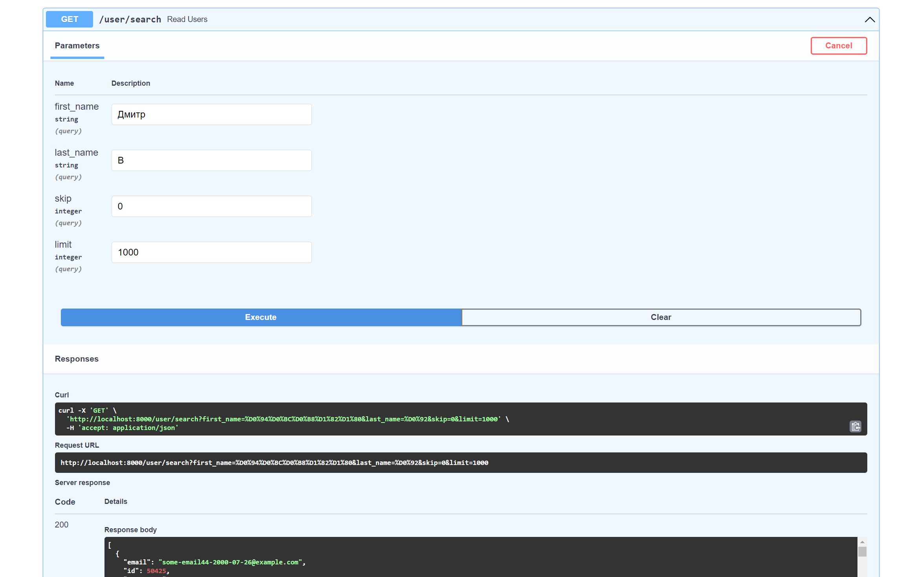
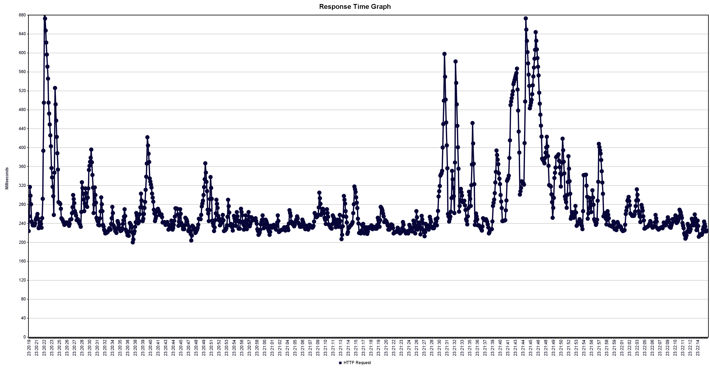

# Результаты нагрузочного тестирования

````commandline
curl -X 'GET' \
  'http://localhost:8000/user/search?first_name=%D0%94%D0%BC%D0%B8%D1%82%D1%80&last_name=%D0%92&skip=0&limit=1000' \
  -H 'accept: application/json'
````
Базовый запрос:

Имя/Фамилия: **Дмитр В**


До создания индексов:
## 1 поток(запрос):
- Latency: ~ 280ms

- Throughput: 228 rounds/minute


## 10 потоков:
- Latency: = 2476ms
- Throughput: 231 rounds/minute


## 20 потоков

- Latency: ~ 4800ms
- Throughput: 231 rounds/minute


## Более 20 потоков
- приложению не хватает ресурсов, срабатывают таймауты

# SQL запросы

SELECT *
FROM users
WHERE users.first_name LIKE 'Д%' AND users.second_name LIKE 'В%'
LIMIT 2000;

# Создание индекса

````commandline
CREATE INDEX firstname_lastname
    ON public.users USING btree
    (first_name ASC NULLS LAST, second_name ASC NULLS LAST)
    TABLESPACE pg_default;
````

----

1 апреля


