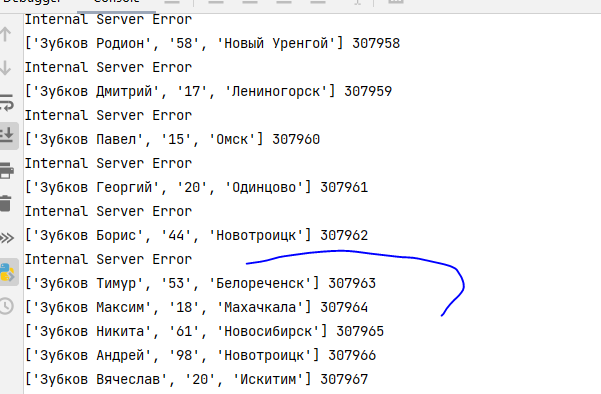

# Настройка репликации 
[docker-compose](../docker-compose.yml)

`winpty docker exec -it highload_arthitect_ot-db-1   sh`

## Настройка на master
```
postgres=# SHOW config_file;
               config_file                
------------------------------------------
 /var/lib/postgresql/data/postgresql.conf
(1 row)
```

Добавил строку в:
`/var/lib/postgresql/data/pg_hba.conf`

`host    replication     rep_user        172.26.0.1/16            md5`

`docker exec -it highload_arthitect_ot-db-1 /bin/sh`
>su postgres
>  vi /var/lib/postgresql/data/pg_hba.conf

настройка (не для продакшн)
**/var/lib/postgresql/data/postgresql.conf**
```commandline
listen_addresses = '*'
hot_standby = on
wal_level = replica
synchronous_commit = on
max_wal_senders = 10
# no: #synchronous_standby_names = ''
```

в контейнере highload_arthitect_ot-db-1 
```
postgres@f530878c26e4:~$  createuser --replication -P rep_user --username username
>pass: rep
CREATE ROLE rep_user WITH LOGIN PASSWORD 'rep' REPLICATION;
```

### на replica-1,2
winpty docker exec -it highload_arthitect_ot-db-replica-1-1   sh
winpty docker exec -it highload_arthitect_ot-db-replica-2-1   sh
#### на обоих 
su - postgres 
rm -rf /var/lib/postgresql/data/* 
pg_basebackup -h db  -D  /var/lib/postgresql/data/ -U rep_user -P -v -R  -X stream

_специфика Doker:_
во время выполнения можно просто добавить строку:
    #entrypoint: 'sleep infinity'
так как время синхронизации быстро _разъезжается_ и бд не всегда стартует...

на replicas:
`/var/lib/postgresql/data/postgresql.conf`
````
primary_conninfo = 'host=db user=rep_user password=rep'
````


## Замер результатов 
Мастер при эталонном нагрузочном

CPU / Mem/ 
50%/72%/ 
или так 
`docker stats highload_arthitect_ot-db-1`


меняю host=replica-1
```commandline
docker stats highload_arthitect_ot-app-1 highload_arthitect_ot-db-1 highload_arthitect_ot-db-replica-1-1 highload_arthit
ect_ot-db-replica-2-1
```


## Подключил реплику 

вся нагрузка по чтению перешла на replica-1


## Настройка синхронной репликации
- убеждаемся что стоит настройка synchronous_commit = on
`/var/lib/postgresql/data/postgresql.conf` 
synchronous_commit = on         # synchronization level;
- ставим синхронные узлы
- в db и в replica-1 правим:
`synchronous_standby_names = 'FIRST 2 ("db", "db-replica-1")' `
перезапуск db, replica-1:
`docker-compose up --build`

```commandline
set application_name to 'db'; #на соответсвующих узлах
set application_name to 'db-replica-1'; #на соответсвующих узлах
```

---

### Создаем нагрузку на запись

```commandline
python people-filler.py #Увы, но сразу ссылаемся на реплику db-replica-1 сразу
```

Заходим в контейнер с репликой и выполняем команду
```
pg_ctl -D ~/data/ promote
```

Запись пошла

Потери ~1000 записей (все время недоступности сервера, до promote)